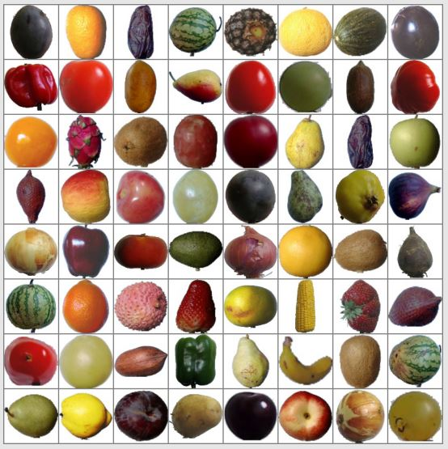
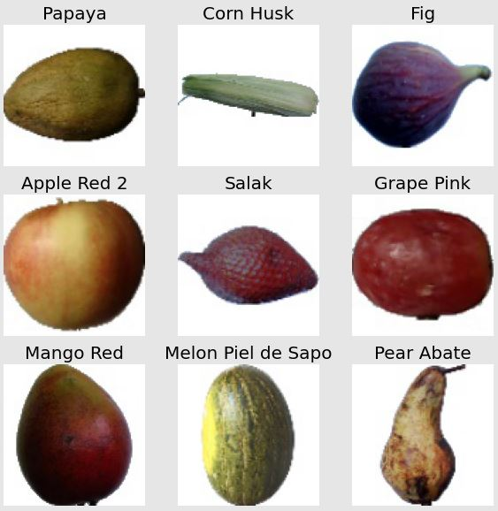
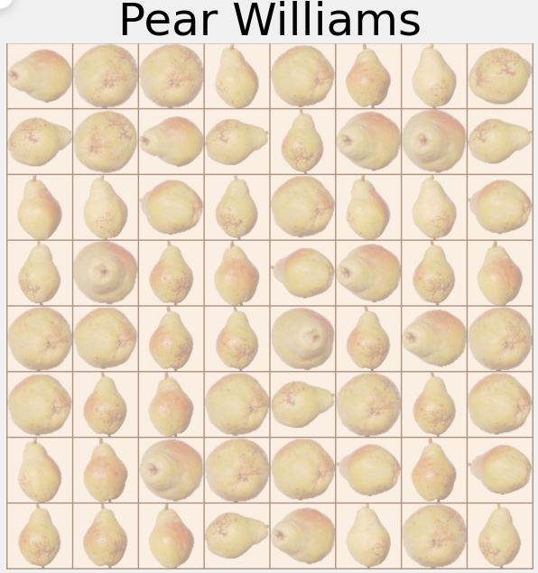
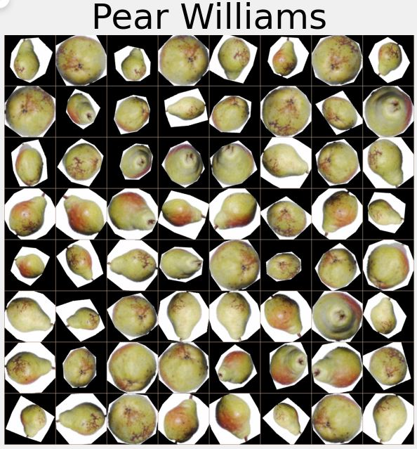
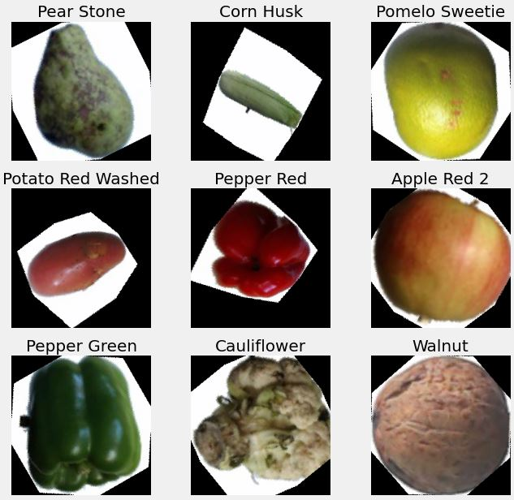
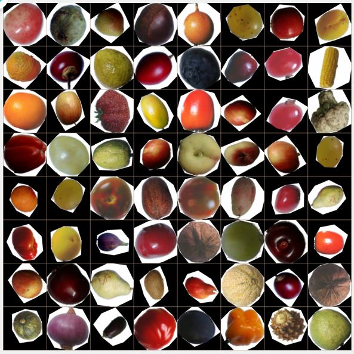
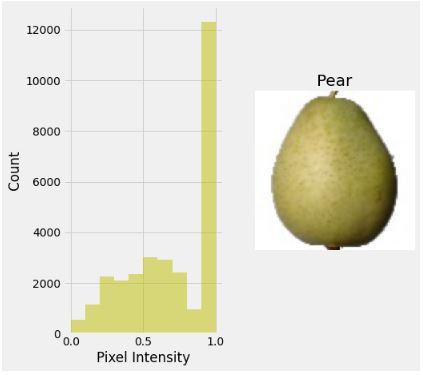
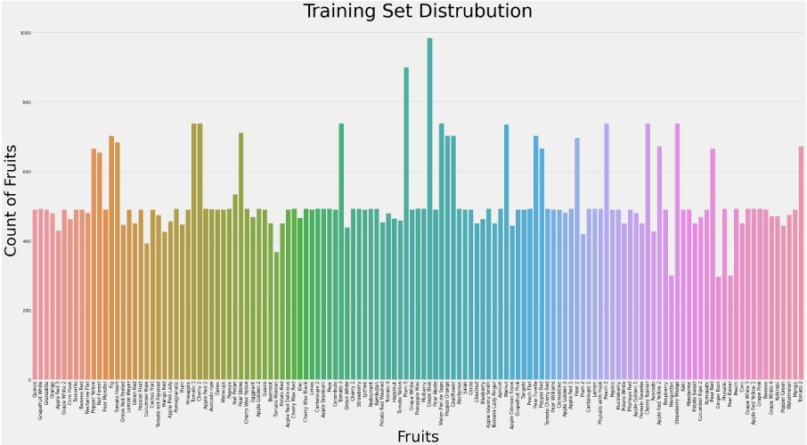
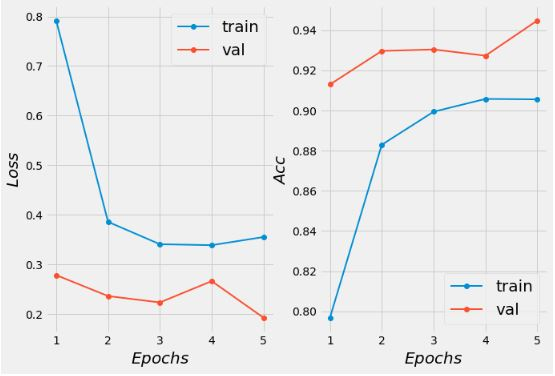
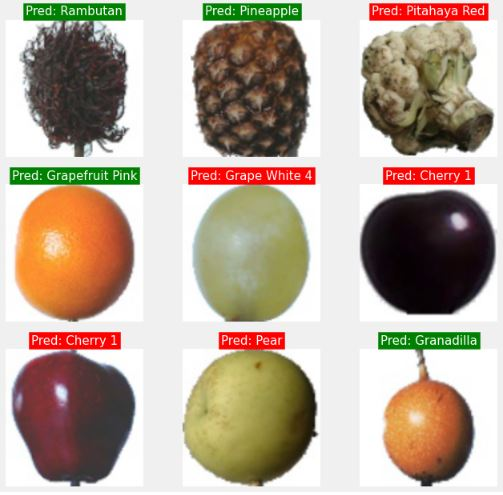

# FruitsClassifier on Fruits 360

  

### _On this project, I build a classifier on the Fruits 360 dataset using Pytorch. I use a pretrained model and transfer learning, as well as do hyper-parameter search to help increase the accuracy._

## 📺 **Youtube Videos:**

<!-- YOUTUBE:START -->

- [Visualize images in image classification task.](https://www.youtube.com/watch?v=vzr0pAU0BC0)
- [Full Pytorch training pipeline on image classification task.](https://www.youtube.com/watch?v=tfYR8JMt0xA)
<!-- YOUTUBE:END -->

## **✍️ Documentation:**

### - _Full Training on [Kaggle] | GoogleNet | 94% Acc_

### - _Efficient Training with Pytorch Lightning_

&nbsp;

## **📰 Dataset structure**

    train/test
        |___apple_braeburn_1
            |___r0_0.jpg
            |___r0_10.jpg
                ...
        |___carrot_1
            |___r0_0.jpg
            |___r0_10.jpg
            ...

&nbsp;

## **Large batch visualization**

&nbsp;

## **Separate visualization**

&nbsp;

## **Single fruit batch visualization**

&nbsp;

## **Single fruit visualization with transforms**

&nbsp;

## **Separate visualization with transforms**

&nbsp;

## **Batch visualization with transforms**

&nbsp;

## **Pixel Intensity**

&nbsp;

## **Visualize the number of classes**

&nbsp;

## **Visualize loss and accuracy**

&nbsp;

## **Visualize model predictions: green(correct) and red(incorrect)**

[kaggle]: https://www.kaggle.com/code/alevi0989/fruits-360-googlenet-94-acc
